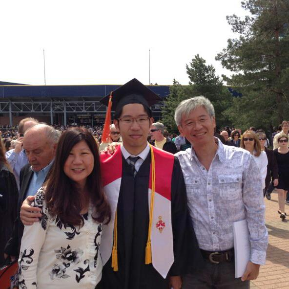

I am a recent Aerospace Engineering graduate currently looking to enter the industry or pursue a PhD in CFD (Computational Fluid Dynamics). I have always been fascinated with problem solving and engineering design and hope I get the opportunity to work on interesting projects. The purpose of this website is to showcase the projects that I have taken up as well as share some insights and opinions on topics I find interesting.

Prior to this, I got my Master's and Bachelor's degrees in Aerospace Engineering from the Universiy of Michigan (Go Blue!), specializing in fluid dynamics and CFD. My academic areas of interest are in the following:

* Adaptive mesh generation for CFD
* Efficient algorithms in CFD
* Simulating high speed compressible flows

In my spare time I enjoy listening to music, watching movies, and reading up my topics/things that interest me. Some of said topics are in:

* Consumer Technology
* Audiophile equipment
* Sports Cars
* Horological Timepieces
* College Sports
* Tennis

If you have any comments or would like to contact me for any reason, just drop me an email.

Thanks for reading!
